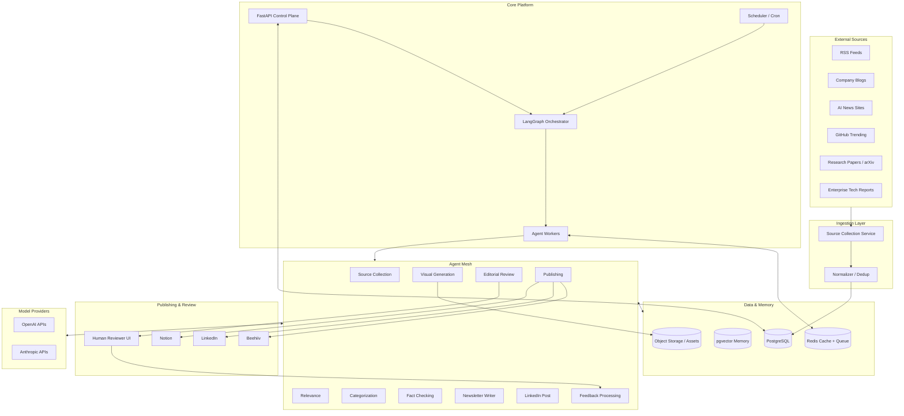
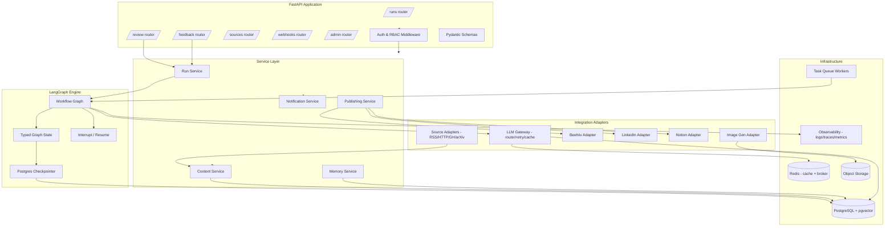
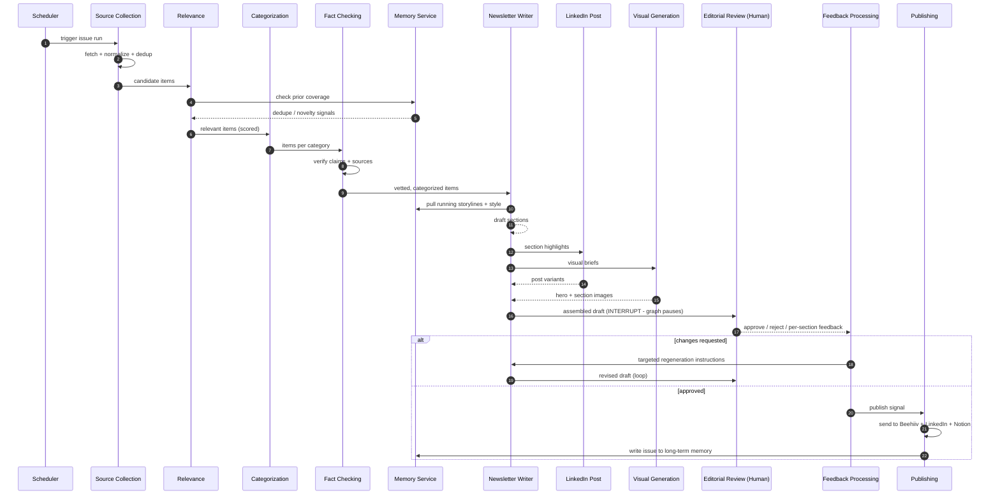
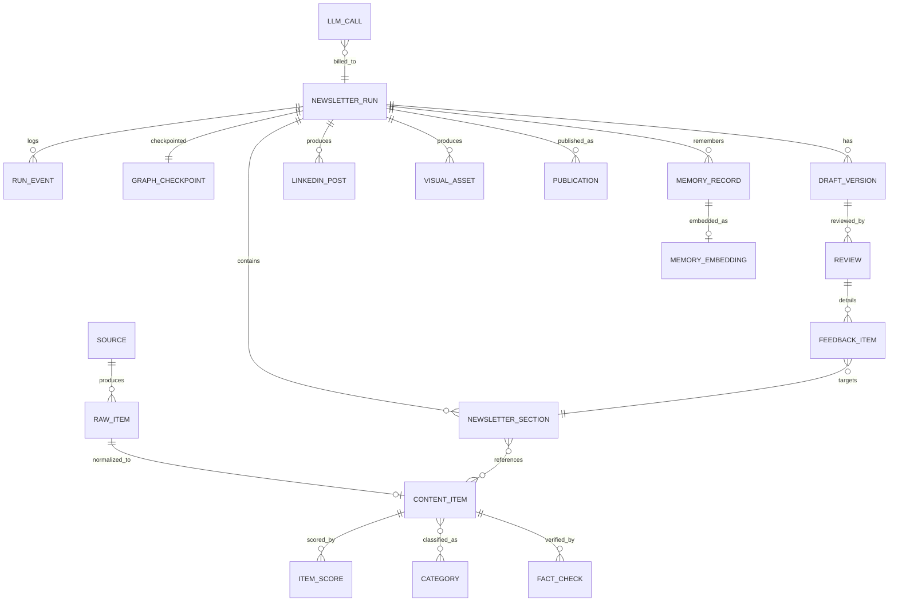
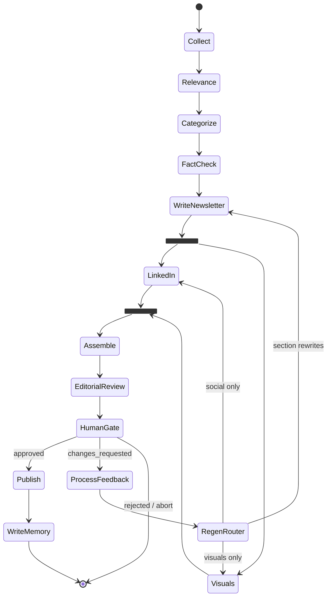
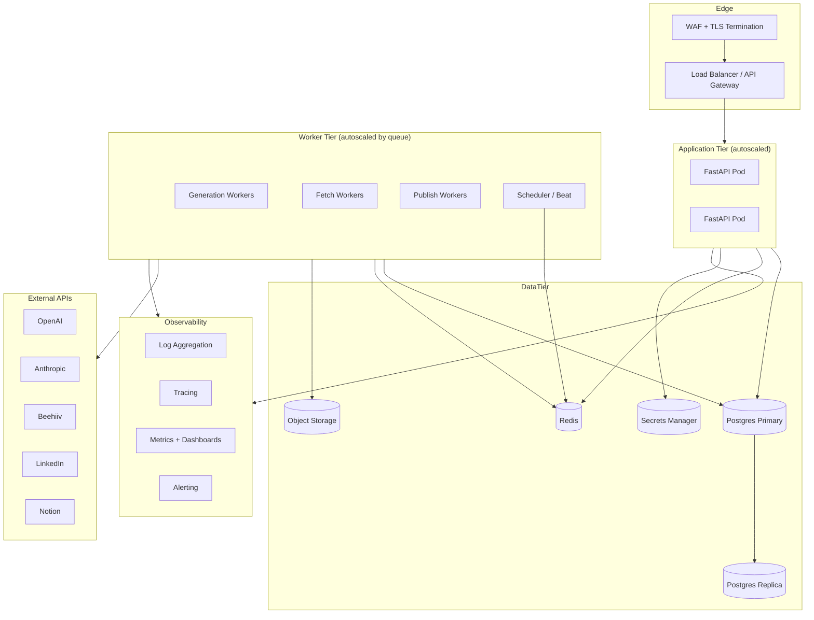

# Agentic AI Newsletter Platform — Architecture Document

**Status:** Design v1.0
**Author:** Principal Software Architect
**Scope:** Production-grade, multi-agent content pipeline for an AI / Software Engineering / QA / Enterprise Technology newsletter.

---

## 0. Executive Summary

This platform is an **autonomous, human-in-the-loop content factory**. A graph of specialized AI agents collects content from many sources, filters and categorizes it, fact-checks it, writes the newsletter and LinkedIn posts, generates visuals, then routes a draft to a human editor. Reviewer feedback re-enters the graph and selectively regenerates only the affected sections. Approved issues are published to Beehiiv, LinkedIn, and archived to Notion. The system keeps **long-term memory** across issues to avoid repetition, track evolving stories, and improve relevance over time.

The orchestration backbone is **LangGraph** (stateful, resumable, supports interrupts for human review). The control plane is **FastAPI**. State, content, and memory live in **PostgreSQL** (with `pgvector` for semantic memory). The whole thing is containerized with **Docker** and deployed as decoupled API + worker services.

Core design principles:

1. **Durable, resumable workflows** — a run can pause for hours (human review) and resume without losing state.
2. **Every agent is idempotent and replayable** — re-running a node never corrupts state.
3. **Human-in-the-loop is a first-class state**, not a bolt-on.
4. **Provenance everywhere** — every claim, link, and generated sentence traces back to a source.
5. **Cost & rate-limit awareness** — LLM calls are batched, cached, and model-tiered.

---

## 1. High-Level Architecture



**Plane separation:**

- **Control plane (FastAPI):** triggers runs, exposes review/feedback endpoints, status, admin, webhooks. Stateless, horizontally scalable.
- **Orchestration plane (LangGraph):** the workflow state machine. Runs inside worker processes, checkpoints to Postgres.
- **Data plane (Postgres + pgvector + object storage + Redis):** durable state, content, vector memory, assets, queue.
- **Integration plane:** adapters to OpenAI/Anthropic and to Beehiiv/LinkedIn/Notion.

---

## 2. Detailed Component Diagram

> ⚠️ **Design-time diagram.** The implementation diverged from this sketch
> (e.g. in-process `MemorySaver` instead of a Postgres checkpointer; no
> pgvector, Celery workers, or S3). For the accurate as-built pipeline and data
> flow, see [`backend/docs/agent_dataflow.md`](backend/docs/agent_dataflow.md).



**Component responsibilities:**

| Component | Responsibility |
|---|---|
| **FastAPI routers** | HTTP surface: trigger runs, serve drafts to reviewers, accept feedback, manage sources, receive webhooks (Beehiiv/LinkedIn callbacks). |
| **Service layer** | Business logic, transaction boundaries, isolates routers from the graph and DB. |
| **LLM Gateway** | Single choke point for all model calls: provider routing (OpenAI vs Anthropic), model tiering, retries, timeouts, token/cost accounting, prompt caching, structured-output validation. |
| **Source Adapters** | Per-source-type fetchers with rate limiting, conditional GET (ETag/Last-Modified), pagination, and raw-payload archiving. |
| **LangGraph Engine** | Stateful agent orchestration with a Postgres checkpointer; supports interrupt-before-node for human review and resume-with-feedback. |
| **Publishing adapters** | Idempotent, retried delivery to Beehiiv / LinkedIn / Notion with external-ID reconciliation. |
| **Task Queue Workers** | Execute long-running graph runs off the request thread (Celery/Arq/Dramatiq on Redis). |
| **Observability** | Structured logs, distributed traces (per run + per agent + per LLM call), metrics, cost dashboards. |

---

## 3. Agent Interaction Diagram

> ⚠️ **Design-time diagram.** The as-built flow has separate automated
> `editorial_review` and `human_review` nodes, an `approval_router`, and a
> `feedback_processor → draft_regeneration → editorial_review` loop, and has no
> memory/pgvector service. See
> [`backend/docs/agent_dataflow.md`](backend/docs/agent_dataflow.md) for the
> accurate version.



**Interaction notes:**

- The graph **physically pauses** at the Editorial Review node (LangGraph `interrupt`). No worker is held; state is checkpointed to Postgres. The run resumes when the `/feedback` endpoint posts the reviewer's decision.
- **Memory is read** by Relevance (novelty/dedup) and the Writer (continuity/style), and **written** by Publishing (closing the loop).
- The Writer is the **hub**: it fans out to LinkedIn + Visual agents and fans back in. These run in parallel.
- Feedback Processing is a **router**, not a writer — it classifies feedback and dispatches only the affected sections for regeneration.

---

## 4. Database Schema

PostgreSQL with `pgvector`. Logical groups: **Sources & Content**, **Runs & Workflow**, **Generated Artifacts**, **Review & Feedback**, **Publishing**, **Memory**.



### Key tables (column sketch)

**Sources & Content**

- `source` — `id, type (rss|blog|news|github|paper|report), name, url, config(jsonb), fetch_cadence, etag, last_fetched_at, is_active, weight`
- `raw_item` — `id, source_id, external_id, raw_payload(jsonb), fetched_at, content_hash` *(unique on `(source_id, external_id)` and on `content_hash` for dedup)*
- `content_item` — `id, raw_item_id, title, author, url(canonical), published_at, summary, full_text, language, content_hash, status`
- `category` — `id, key, label` *(AI News, AI Tools, QA & Testing, Software Engineering, Enterprise AI, Career Development)*
- `content_item_category` — `content_item_id, category_id, confidence`
- `item_score` — `id, content_item_id, run_id, relevance_score, novelty_score, authority_score, rationale, model`
- `fact_check` — `id, content_item_id, run_id, verdict (supported|unverified|contradicted), claims(jsonb), evidence(jsonb), confidence`

**Runs & Workflow**

- `newsletter_run` — `id, issue_number, theme, status (collecting|filtering|writing|in_review|revising|approved|published|failed), scheduled_for, created_at, current_node, error`
- `graph_checkpoint` — `id, run_id, thread_id, checkpoint(jsonb/bytea), parent_id, created_at` *(LangGraph durable state)*
- `run_event` — `id, run_id, agent, event_type, payload(jsonb), level, created_at` *(audit/observability trail)*

**Generated Artifacts**

- `draft_version` — `id, run_id, version_no, status, created_by (agent|feedback), full_markdown, subject_line, summary`
- `newsletter_section` — `id, run_id, draft_version_id, category_id, position, heading, body_markdown, regen_count`
- `newsletter_section_source` — `section_id, content_item_id` *(provenance)*
- `linkedin_post` — `id, run_id, variant, body, hashtags, status, scheduled_for, external_post_id`
- `visual_asset` — `id, run_id, section_id (nullable), kind (hero|section|social), prompt, model, storage_key, alt_text, status`

**Review & Feedback**

- `review` — `id, draft_version_id, reviewer_id, decision (approved|changes_requested|rejected), overall_notes, created_at`
- `feedback_item` — `id, review_id, section_id (nullable), type (rewrite|tone|factual|cut|add), instruction, status (open|applied)`

**Publishing**

- `publication` — `id, run_id, channel (beehiiv|linkedin|notion), external_id, url, status (pending|sent|failed), payload(jsonb), published_at`

**Memory**

- `memory_record` — `id, run_id (nullable), kind (issue_summary|storyline|entity|style_note|covered_url), title, body, metadata(jsonb), created_at`
- `memory_embedding` — `memory_record_id, embedding vector(1536), model` *(pgvector; ivfflat/hnsw index for ANN search)*

**Cost & Ops**

- `llm_call` — `id, run_id, agent, provider, model, prompt_tokens, completion_tokens, cost_usd, latency_ms, cached, created_at`
- `user` / `role` — reviewer & admin accounts, RBAC.

**Indexing highlights:** `content_item(content_hash)` unique; `content_item(published_at)`; GIN on `jsonb` config/payload columns; `pgvector` HNSW on `memory_embedding.embedding`; partial index on `newsletter_run(status)` for active runs.

---

## 5. API Architecture

REST + webhooks, versioned under `/api/v1`. JSON, Pydantic-validated, OpenAPI auto-documented. Long-running operations are **async-by-default**: trigger returns a `run_id`, progress is polled or streamed.

| Method | Path | Purpose |
|---|---|---|
| `POST` | `/api/v1/runs` | Trigger a new newsletter run (optional theme/date). Returns `run_id`. |
| `GET` | `/api/v1/runs/{id}` | Run status, current node, draft pointer. |
| `GET` | `/api/v1/runs/{id}/events` | SSE/stream of run progress (per-agent events). |
| `POST` | `/api/v1/runs/{id}/cancel` | Cancel an in-flight run. |
| `GET` | `/api/v1/runs/{id}/draft` | Latest assembled draft (sections, LinkedIn posts, visuals). |
| `GET` | `/api/v1/reviews/pending` | Reviewer queue: drafts awaiting review. |
| `POST` | `/api/v1/runs/{id}/review` | Submit decision: `approved` / `changes_requested` / `rejected`. |
| `POST` | `/api/v1/runs/{id}/feedback` | Submit per-section feedback items; **resumes the paused graph**. |
| `POST` | `/api/v1/runs/{id}/publish` | Force/confirm publish of an approved run. |
| `GET/POST/PATCH` | `/api/v1/sources` | CRUD + enable/disable content sources. |
| `POST` | `/api/v1/sources/{id}/test` | Dry-run fetch a source. |
| `GET` | `/api/v1/issues` | Published archive. |
| `GET` | `/api/v1/memory/search` | Semantic search over historical memory (admin/debug). |
| `POST` | `/api/v1/webhooks/beehiiv` | Delivery/engagement callbacks. |
| `POST` | `/api/v1/webhooks/linkedin` | Post status callbacks. |
| `GET` | `/api/v1/health`, `/ready` | Liveness/readiness probes. |
| `GET` | `/api/v1/admin/costs` | Cost/usage reporting. |

**Conventions:**

- **Idempotency keys** on `POST /runs` and `/publish` to prevent duplicate runs/publishes.
- **Auth:** OAuth2/OIDC for human reviewers (JWT bearer); API keys/mTLS for service-to-service and webhooks (HMAC-signed payloads).
- **RBAC roles:** `admin`, `editor` (review/feedback/publish), `viewer`, `service`.
- **Pagination:** cursor-based on list endpoints. **Errors:** RFC 7807 problem+json.
- **The review/feedback endpoints are the human-in-the-loop bridge** — they write the reviewer decision into graph state and signal LangGraph to resume the checkpointed thread.

---

## 6. Folder Structure

```
ainewsletter/
├── app/
│   ├── main.py                     # FastAPI app factory, lifespan, router mount
│   ├── api/
│   │   └── v1/
│   │       ├── routers/            # runs, reviews, feedback, sources, webhooks, admin, health
│   │       └── dependencies.py     # auth, db session, rate-limit deps
│   ├── schemas/                    # Pydantic request/response models
│   ├── services/                   # run, content, memory, publishing, notification
│   ├── agents/
│   │   ├── base.py                 # agent contract, shared prompt scaffolding
│   │   ├── source_collection/
│   │   ├── relevance/
│   │   ├── categorization/
│   │   ├── fact_checking/
│   │   ├── newsletter_writer/
│   │   ├── linkedin_post/
│   │   ├── visual_generation/
│   │   ├── editorial_review/
│   │   ├── feedback_processing/
│   │   └── publishing/
│   ├── graph/
│   │   ├── workflow.py             # LangGraph graph definition + edges
│   │   ├── state.py                # typed GraphState (TypedDict/Pydantic)
│   │   ├── nodes.py                # node wrappers around agents
│   │   ├── routers.py              # conditional edge functions
│   │   └── checkpointer.py         # Postgres checkpointer config
│   ├── integrations/
│   │   ├── llm/                    # gateway, provider clients (openai, anthropic), caching
│   │   ├── sources/                # rss, http, github, arxiv, reports adapters
│   │   ├── beehiiv/
│   │   ├── linkedin/
│   │   ├── notion/
│   │   └── images/                 # image-gen adapter
│   ├── db/
│   │   ├── models/                 # SQLAlchemy ORM models
│   │   ├── session.py              # engine, session factory
│   │   └── repositories/           # data-access layer
│   ├── memory/                     # vector store wrapper, retrieval, summarization
│   ├── workers/                    # queue tasks (run execution, fetch jobs)
│   ├── core/                       # config, logging, security, errors, telemetry
│   └── prompts/                    # versioned prompt templates per agent
├── migrations/                     # Alembic
├── tests/
│   ├── unit/  integration/  e2e/   evals/   # incl. agent output evals & golden sets
├── deploy/
│   ├── docker/                     # Dockerfiles (api, worker)
│   ├── compose/                    # docker-compose for local
│   └── k8s/ (or terraform/)        # production manifests / IaC
├── scripts/                        # seed sources, backfill, ops tools
├── docs/                           # this file, runbooks, ADRs
├── pyproject.toml
├── .env.example
└── README.md
```

**Conventions:** each agent package owns its `prompt`, `agent`, and `schema` (typed I/O). Agents never talk to providers directly — only through `integrations/llm`. Routers never touch the DB directly — only through `services` → `repositories`.

---

## 7. LangGraph Workflow

### State

A single typed `GraphState` flows through the graph (run id, candidate items, scored items, categorized items, fact-check results, draft sections, LinkedIn posts, visuals, review decision, feedback items, retry counters, error). The state is **checkpointed to Postgres after every node**, making the run durable and resumable.

### Graph topology



### Node behavior

| Node | Agent | Reads | Writes | Notes |
|---|---|---|---|---|
| Collect | Source Collection | sources | `content_item`, `raw_item` | Fan-out per source; dedup by hash; conditional GET. |
| Relevance | Relevance | items + memory | `item_score` | Drops below-threshold; checks novelty vs prior coverage. |
| Categorize | Categorization | scored items | `content_item_category` | Multi-label, confidence-scored. |
| FactCheck | Fact Checking | categorized items | `fact_check` | Flags/removes contradicted claims; can web-verify. |
| WriteNewsletter | Newsletter Writer | vetted items + memory | `newsletter_section`, `draft_version` | Pulls running storylines + house style from memory. |
| LinkedIn | LinkedIn Post | sections | `linkedin_post` | Parallel branch. |
| Visuals | Visual Generation | sections | `visual_asset` (→ object storage) | Parallel branch. |
| Assemble | (system) | branches | `draft_version` | Joins branches into one draft. |
| EditorialReview | Editorial Review | draft | review payload | **`interrupt()` here** — graph pauses, state persisted. |
| ProcessFeedback | Feedback Processing | feedback | regen instructions | Classifies feedback → routes selectively. |
| Publish | Publishing | approved draft | `publication` | Idempotent multi-channel send. |
| WriteMemory | (Publishing) | issue | `memory_record` + embeddings | Closes the learning loop. |

### Human-in-the-loop mechanics

1. Graph reaches `EditorialReview` and calls `interrupt()`. LangGraph checkpoints the thread to Postgres and **returns control** — no worker is blocked.
2. Reviewer is notified (Slack/email/Notion). They view the draft via `GET /runs/{id}/draft`.
3. Reviewer posts to `/runs/{id}/feedback`. The service writes the decision into state and **resumes the thread** (`Command(resume=...)`).
4. On `changes_requested`, `ProcessFeedback` → `RegenRouter` sends only affected sections back to the writer/LinkedIn/visual nodes (tracked via `regen_count` to cap loops, e.g., max 3).
5. On `approved`, the graph proceeds to `Publish` → `WriteMemory`.

**Resilience:** every node is idempotent; failed nodes retry with backoff; a dead-letter path marks the run `failed` with the offending node recorded for replay from the last good checkpoint.

---

## 8. Scalability Considerations

**Stateless API, stateful workers.**
- FastAPI is stateless → scale horizontally behind a load balancer.
- Graph runs execute on a **worker pool** (Celery/Arq/Dramatiq on Redis), decoupled from HTTP. Scale workers independently by queue depth.

**Concurrency & fan-out.**
- Source collection fans out per source as parallel queue jobs with **per-domain rate limiting** and politeness windows.
- Writer → LinkedIn/Visual branches run concurrently inside the graph.
- Use **separate queues** (`fetch`, `generate`, `publish`) so slow image/LLM jobs don't starve fast ones.

**LLM throughput & cost.**
- **Model tiering:** cheap/fast models for relevance & categorization (high volume), frontier models for writing & fact-checking (high value).
- **Batching** of classification/scoring calls; **prompt caching** for stable system prompts; **semantic cache** for repeated summaries.
- Centralized **rate-limit/backpressure** in the LLM Gateway with provider failover (OpenAI ↔ Anthropic).

**Data layer.**
- Postgres: read replicas for archive/analytics queries; partition high-volume tables (`raw_item`, `llm_call`, `run_event`) by time.
- pgvector with **HNSW** index; if memory grows large, route ANN to a dedicated vector store.
- Redis for hot caches (source ETags, dedup bloom-ish sets, idempotency keys) and as broker.
- Object storage (S3-compatible) for visuals — never store binaries in Postgres.

**Workflow scale.**
- Many issues/runs can be in flight; each is an isolated LangGraph `thread_id`. Checkpointing makes long human-review pauses essentially free (no held resources).

**Bottleneck management.**
- Backpressure via bounded queues; autoscale workers on queue length + LLM concurrency budget; circuit breakers on each external integration.

---

## 9. Security Considerations

**Secrets & keys.** All provider/integration credentials in a secrets manager (Vault / cloud KMS), never in code or images. Rotate regularly. Scoped per-integration.

**AuthN/AuthZ.** OIDC for humans (reviewers/admins) with JWT; RBAC (`admin`/`editor`/`viewer`/`service`). Service-to-service via mTLS or signed API keys. Least privilege on DB roles.

**Webhook security.** HMAC signature verification + timestamp/nonce replay protection on all inbound webhooks (Beehiiv/LinkedIn). Allowlist source IPs where possible.

**Prompt-injection & content safety.** Ingested third-party content is **untrusted input**. Mitigations:
- Strip/escape instructions from scraped content before it enters prompts; clearly delimit untrusted content in prompt templates.
- Fact-Check + Editorial gates catch injected/false claims before publish.
- Never let ingested content trigger tool calls or system actions; tools are gated to system-controlled inputs only.
- Output moderation pass before publishing (toxicity, PII leakage, copyright-length quotes).

**Data protection.** TLS in transit; encryption at rest for DB + object storage. PII minimization for subscriber data (much of it lives in Beehiiv — keep it there, don't duplicate). GDPR/CCPA deletion paths.

**Supply chain & runtime.** Pinned dependencies + vulnerability scanning (SCA); image scanning; non-root containers; read-only filesystems where feasible; network policies restricting egress to known provider endpoints.

**Auditability.** Immutable `run_event` and `llm_call` logs; every published sentence traceable to sources (provenance tables); reviewer decisions recorded with identity + timestamp.

**Abuse/cost controls.** Per-run and per-day token/cost budgets enforced in the LLM Gateway; alerts on anomalies; rate limits on public endpoints.

---

## 10. Deployment Architecture



**Topology:**

- **Containers:** two images — `api` and `worker` — from a shared base. Same codebase, different entrypoints.
- **Local dev:** `docker-compose` (api, worker, postgres+pgvector, redis, minio, mailhog).
- **Production:** Kubernetes (or ECS) — API Deployment behind ingress/LB; Worker Deployments per queue with HPA on queue depth; a single Scheduler/Beat for cadence triggers; managed Postgres (with pgvector) + managed Redis + S3-compatible storage.
- **CI/CD:** lint → type-check → unit/integration tests → **agent evals (golden-set quality gate)** → image build & scan → migrate (Alembic) → rolling deploy. Blue/green or canary for the API.
- **Migrations:** Alembic run as a pre-deploy job. Backward-compatible (expand/contract) to allow rolling updates.
- **Backups/DR:** automated Postgres PITR; object-storage versioning; documented restore runbook; checkpointer state in Postgres means runs survive restarts.
- **Environments:** dev / staging / prod with isolated credentials and source allowlists (staging uses sandboxed publishing targets — no live sends).

---

## 11. Technology Choices & Rationale

| Choice | Why |
|---|---|
| **Python** | Best ecosystem for AI/LLM tooling, scraping, and data work; team velocity. |
| **FastAPI** | Async-first, Pydantic validation, auto OpenAPI, excellent for an LLM-bound I/O workload; clean dependency-injection for auth/DB. |
| **LangGraph** | Purpose-built for **stateful, cyclic, human-in-the-loop** agent workflows. Native checkpointing + `interrupt`/resume is exactly the review→feedback→regenerate loop. Plain DAG tools (or hand-rolled state machines) don't model long pauses + selective re-entry cleanly. |
| **PostgreSQL** | Single source of truth for relational state, JSONB flexibility for payloads/config, strong transactional guarantees, mature ops. Doubles as the LangGraph checkpoint store — fewer moving parts. |
| **pgvector** | Keeps long-term semantic memory **inside Postgres** — one datastore, transactional consistency with content. Graduate to a dedicated vector DB only if scale demands. |
| **SQLAlchemy + Alembic** | Mature ORM + migrations; repository pattern keeps data access testable and decoupled. |
| **Redis** | Dual role: low-latency cache (ETags, dedup, idempotency, semantic cache) and message broker for the worker queue. |
| **Object storage (S3-compatible)** | Correct home for generated visuals; cheap, durable, CDN-friendly; keeps binaries out of the DB. |
| **OpenAI + Anthropic (both)** | **Provider redundancy and model tiering.** Route by task: frontier reasoning/writing/fact-check to the strongest model; cheap high-volume scoring/classification to fast models; failover across providers for resilience and rate-limit headroom. |
| **LLM Gateway abstraction** | Avoids vendor lock-in, centralizes retries/caching/cost accounting/structured-output validation; one place to change models. |
| **Docker** | Reproducible builds, parity dev↔prod, clean api/worker separation, straightforward K8s/ECS deploy. |
| **Beehiiv integration** | Specialized newsletter platform handles delivery, subscriber management, and engagement analytics — don't rebuild email infrastructure. |
| **LinkedIn integration** | Primary distribution channel for this audience (engineering/QA/IT leadership). |
| **Notion integration** | Natural archive + editorial workspace; gives non-technical stakeholders visibility into history and drafts. |
| **Task queue (Celery/Arq/Dramatiq)** | Moves long LLM/graph runs off the request path; independent scaling; retries and scheduling. |
| **Alembic expand/contract migrations** | Zero-downtime rolling deploys. |
| **OpenTelemetry-based observability** | Per-run, per-agent, per-LLM-call tracing is essential for debugging non-deterministic agent behavior and controlling cost. |

---

## Appendix A — Cross-Cutting Concerns

- **Provenance:** every section links to its `content_item` sources; every claim links to fact-check evidence. Required before publish.
- **Quality gates / evals:** golden-set tests on agent outputs run in CI; runtime guardrails (schema validation, factuality verdicts, toxicity/PII checks) gate publishing.
- **Idempotency:** runs, publishes, and external sends use idempotency keys + external-ID reconciliation to survive retries without duplicates.
- **Loop safety:** `regen_count` per section caps feedback cycles; runaway runs are auto-escalated to a human.
- **Cost governance:** per-run + daily budgets enforced in the LLM Gateway; cost dashboards and anomaly alerts.
- **Memory hygiene:** periodic summarization/compaction of memory records; retention policy on raw payloads and logs.

## Appendix B — Suggested Build Sequence

1. Skeleton: FastAPI + Postgres + Alembic + Docker compose + LLM Gateway.
2. Ingestion: source adapters + normalizer + dedup → populate `content_item`.
3. Filtering: Relevance + Categorization + Fact-Check agents (the cheap-model path).
4. Generation: Newsletter Writer + memory read; then LinkedIn + Visuals branches.
5. LangGraph wiring with Postgres checkpointer + the human-review `interrupt`.
6. Review UI/endpoints + Feedback Processing + selective regeneration loop.
7. Publishing adapters (Beehiiv/LinkedIn/Notion) + WriteMemory.
8. Observability, evals, cost controls, hardening, then production deploy.
```
