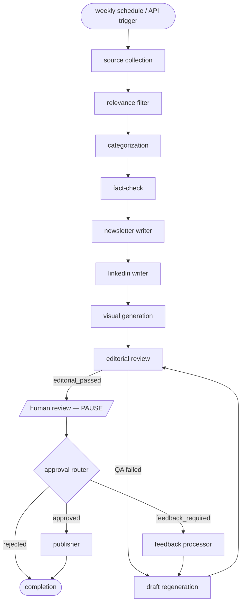

# Agentic AI Newsletter Platform

An autonomous, agent-driven platform that researches, writes, fact-checks,
illustrates, and publishes a weekly newsletter — **"AI & Quality Engineering
Weekly"** — for QA leaders, test managers, engineering leaders, and IT
professionals.

A LangGraph workflow chains **12 specialized agents** end to end: it collects
sources, filters and categorizes them, fact-checks claims, writes the
newsletter (plus a LinkedIn post), generates cover/carousel visuals, runs an
editorial pass, **pauses for a human review**, processes your feedback, and
publishes to Beehiiv / LinkedIn / email.

> 📐 Full system design: [`ARCHITECTURE.md`](ARCHITECTURE.md)
> 🛠️ Operations & production docs: [`backend/docs/PRODUCTION.md`](backend/docs/PRODUCTION.md)

---

## ⭐ The most important thing to know first

**The whole platform runs end-to-end with _zero_ API keys.**

Every external integration is behind an `ENABLE_*` flag that is **off by
default**. With the flags off, the platform uses deterministic, offline
behavior:

| Capability | Flag off (default) | Flag on |
|---|---|---|
| Classification / fact-check / writing / feedback | Rule-based heuristics | Real LLM calls (Anthropic/OpenAI) |
| Cover & carousel images | Programmatically rendered with Pillow | AI image model (OpenAI) |
| Publishing (Beehiiv / LinkedIn / email) | Simulated (logged, no network) | Real API calls |
| Notion review mirror | Skipped | Synced to a Notion database |

So you can clone, start Postgres, and run a complete newsletter generation in
minutes **without signing up for anything**. Add API keys only when you want a
specific capability to be "real". The "[Configuration & API keys](#-configuration--api-keys)"
section below tells you exactly which key unlocks which flag.

---

## How it works — the pipeline

The newsletter is produced by a LangGraph state machine. Each node is an agent;
the workflow **interrupts after Human Review** and waits for your decision before
it continues.



```
START → Source Collection → Relevance Filter → Categorization → Fact-Check
  → Newsletter Writer → LinkedIn Writer → Visual Generation → Editorial Review
  → ⏸ HUMAN REVIEW → Publisher → Completion
```

- **Approve** at human review → the workflow resumes and publishes.
- **Request changes** → feedback is processed and the draft is regenerated and
  re-reviewed before publishing.
- **Reject** → the run ends without publishing.
- Any node failure routes to an error handler that ends the run.

> 📊 Full **as-built** agent + data-flow diagrams (source code-accurate):
> [`backend/docs/agent_dataflow.md`](backend/docs/agent_dataflow.md).

---

## Tech stack

Python 3.12 · FastAPI · LangGraph · SQLAlchemy 2.0 (async) · asyncpg ·
Alembic · PostgreSQL · Pydantic v2 / pydantic-settings · structlog (JSON +
secret masking) · Redis (optional, with in-memory fallback) · APScheduler ·
Prometheus · Pillow · httpx · feedparser · BeautifulSoup4 · Docker / Compose.

Optional, only when you enable real features: Anthropic SDK · OpenAI SDK ·
Beehiiv API · LinkedIn API · Notion API.

---

## Prerequisites

- **Docker + Docker Compose** (recommended path — gives you Postgres too), **or**
- **Python 3.12** and a reachable **PostgreSQL 14+** instance (local path).
- No API keys are required to get started (see above).

---

## Quick start — Docker (recommended)

```bash
cd backend
cp .env.example .env          # defaults work out of the box
docker compose up --build
```

The `api` container waits for Postgres to be healthy, runs `alembic upgrade
head`, then starts Uvicorn. Once it's up:

| What | URL |
|---|---|
| Interactive API docs (Swagger) | http://localhost:8000/docs |
| OpenAPI schema | http://localhost:8000/openapi.json |
| Liveness probe | http://localhost:8000/health |
| Readiness probe | http://localhost:8000/health/ready |
| Prometheus metrics | http://localhost:8000/metrics |

Then **seed reference data** (categories, admin user, system settings) and the
**curated source list** in a second terminal:

```bash
docker compose exec api python -m scripts.seed          # categories, admin, settings
curl -X POST http://localhost:8000/api/sources/seed     # curated content sources
```

## Quick start — local Python

Requires Python 3.12 and a reachable PostgreSQL instance.

```bash
cd backend
python3.12 -m venv .venv
source .venv/bin/activate
pip install -r requirements-dev.txt        # use requirements.txt for runtime-only

cp .env.example .env
# edit .env: set POSTGRES_HOST=localhost (and DB creds if not the defaults)

alembic upgrade head                        # apply schema
python -m scripts.seed                      # categories, admin user, settings

uvicorn app.main:app --reload               # or: bash scripts/run_local.sh
```

Once it's running, seed the curated content sources:

```bash
curl -X POST http://localhost:8000/api/sources/seed
```

---

## Using the platform — end-to-end walkthrough

The newsletter lifecycle is driven by the **workflow API** (mounted at
`/api/workflows`, outside the `/api/v1` prefix). All examples use `curl`; you
can do the same interactively from `/docs`.

### 1. Start a newsletter run

```bash
curl -X POST http://localhost:8000/api/workflows/newsletter/start
```

This kicks off the pipeline. It runs collection → … → editorial review, then
**pauses** at human review and returns `202 Accepted`:

```json
{
  "workflow_run_id": "….",
  "newsletter_id": "….",
  "issue_number": 1,
  "current_step": "human_review",
  "approval_status": "pending",
  "paused": true
}
```

### 2. Check status / inspect the draft

```bash
curl http://localhost:8000/api/workflows/{workflow_run_id}/status
curl http://localhost:8000/api/workflows/{workflow_run_id}/state   # full draft state
```

You can also read the produced artifacts directly:

```bash
curl http://localhost:8000/api/newsletters                       # list issues
curl http://localhost:8000/api/visuals/{newsletter_id}           # generated visuals
curl http://localhost:8000/api/facts/...                         # fact-check results
```

### 3. Submit your review (resume the workflow)

`approval_status` is one of `approved`, `rejected`, `feedback_required`.

```bash
# Approve → workflow resumes and publishes
curl -X POST http://localhost:8000/api/workflows/{workflow_run_id}/review \
  -H "Content-Type: application/json" \
  -d '{"approval_status": "approved", "feedback_items": []}'

# Request changes → feedback is processed, sections regenerated
curl -X POST http://localhost:8000/api/workflows/{workflow_run_id}/review \
  -H "Content-Type: application/json" \
  -d '{
        "approval_status": "feedback_required",
        "feedback_items": [
          {"feedback_type": "general", "feedback_text": "Tighten the intro and add a QA angle."}
        ]
      }'
```

### 4. Publishing

When approved (and `ENABLE_REAL_PUBLISHING` is **off**), publishing is
**simulated** — records are written but no external calls happen. Turn it on and
set the provider keys/IDs to publish for real. You can also drive publishing
directly:

```bash
curl -X POST http://localhost:8000/api/publish/{newsletter_id}             # all channels
curl -X POST http://localhost:8000/api/publish/{newsletter_id}/beehiiv
curl -X POST http://localhost:8000/api/publish/{newsletter_id}/linkedin
curl -X POST http://localhost:8000/api/publish/{newsletter_id}/email       # prepare email package
curl http://localhost:8000/api/publications/{newsletter_id}/analytics
```

> **Auth note:** the `/api/publish`, `/api/publications`, and `/api/subscribers`
> routes are protected by a reviewer dependency. If you set `REVIEW_AUTH_TOKEN`,
> send `Authorization: Bearer <token>`; if it's unset (dev default), access is
> open.

### 5. Automated weekly runs

With `ENABLE_SCHEDULER=true` (default), APScheduler triggers runs on a weekly
cadence. **Run the scheduler on exactly one instance** if you scale to multiple
replicas, to avoid duplicate runs.

---

## 🔑 Configuration & API keys

All configuration is environment variables (or `.env`). The full annotated list
is in [`backend/.env.example`](backend/.env.example); the authoritative schema
is [`backend/app/core/config.py`](backend/app/core/config.py). Copy the example
and edit — **the defaults run fully offline with no keys.**

### Always-needed (have working defaults)

| Variable | Default | Notes |
|---|---|---|
| `APP_ENV` | `local` | `local` / `staging` / `production` |
| `POSTGRES_HOST` | `localhost` | use `db` under docker-compose |
| `POSTGRES_PORT` / `POSTGRES_DB` / `POSTGRES_USER` / `POSTGRES_PASSWORD` | `5432` / `ainewsletter` / `postgres` / `postgres` | change the password for any real deployment |

### Optional API keys — each unlocks one feature flag

You only need a key if you flip the matching flag to `true`. Until then the
feature uses the deterministic offline path.

| Want this to be "real"? | Set flag → | …and provide these keys |
|---|---|---|
| LLM classification | `ENABLE_LLM_CLASSIFICATION=true` | `ANTHROPIC_API_KEY` or `OPENAI_API_KEY` |
| LLM fact-checking | `ENABLE_LLM_FACTCHECK=true` | `ANTHROPIC_API_KEY` or `OPENAI_API_KEY` |
| LLM writing | `ENABLE_LLM_WRITER=true` | `ANTHROPIC_API_KEY` or `OPENAI_API_KEY` |
| LLM feedback processing | `ENABLE_LLM_FEEDBACK=true` | `ANTHROPIC_API_KEY` or `OPENAI_API_KEY` |
| AI-generated images | `ENABLE_AI_IMAGES=true` | `OPENAI_API_KEY` (model `AI_IMAGE_MODEL`, default `gpt-image-1`) |
| Real Beehiiv publishing | `ENABLE_REAL_PUBLISHING=true` | `BEEHIIV_API_KEY` + `BEEHIIV_PUBLICATION_ID` |
| Real LinkedIn publishing | `ENABLE_REAL_PUBLISHING=true` | `LINKEDIN_CLIENT_ID` + `LINKEDIN_CLIENT_SECRET` + `LINKEDIN_AUTHOR_URN` |
| Notion review mirror | — | `NOTION_API_KEY` + `NOTION_REVIEW_DATABASE_ID` |

Which LLM provider is used is controlled by `LLM_PROVIDER` (`anthropic` |
`openai`) and `LLM_MODEL` (default `claude-haiku-4-5-20251001`).

### Security / access

| Variable | Purpose |
|---|---|
| `REVIEW_AUTH_TOKEN` | If set, protected review/publish/subscriber routes require `Authorization: Bearer <token>`. Unset = open (dev only). |
| `SECRET_KEY` | App secret. **Required** in staging/production (startup fails without it). |
| `CORS_ORIGINS` | Comma-separated allowlist. Wildcard `*` is **rejected** in production. |

### Useful knobs (sensible defaults)

| Variable | Default | What it does |
|---|---|---|
| `NEWSLETTER_NAME` | `AI & Quality Engineering Weekly` | Brand name used in output |
| `MIN_CONFIDENCE_FOR_PUBLISH` | `90.0` | Fact-check confidence gate before publish |
| `ENABLE_SCHEDULER` | `true` | Weekly automated runs (single leader only) |
| `RESPECT_ROBOTS_TXT` | `true` | Honor robots.txt during collection |
| `ENABLE_REDIS` / `REDIS_URL` | `false` / — | Use Redis instead of in-memory cache/rate-limit |
| `ENABLE_RATE_LIMIT` / `RATE_LIMIT_PER_MINUTE` | `true` / `120` | Per-client rate limiting |
| `ENABLE_METRICS` | `true` | Expose Prometheus `/metrics` |
| `ENABLE_TRACING` / `OTEL_EXPORTER_OTLP_ENDPOINT` | `false` / — | OpenTelemetry tracing |
| `VISUAL_STORAGE_ROOT` | `storage` | Where generated images are written |

### What production additionally enforces

`get_settings()` **fails fast** at startup if, for `APP_ENV=staging|production`,
any of these are missing/insecure: `SECRET_KEY`, a non-default
`POSTGRES_PASSWORD`, a non-wildcard `CORS_ORIGINS`, `BEEHIIV_API_KEY` when real
publishing is on, and `REDIS_URL` when Redis is on.

> **Never commit secrets.** `.env` is git-ignored. In production, inject secrets
> via your platform's secret manager (see
> [`backend/docs/security.md`](backend/docs/security.md)).

---

## API reference (route groups)

| Mount | Purpose |
|---|---|
| `/api/workflows` | Start runs, check status/state, submit review |
| `/api/sources` | Curated source registry |
| `/api/articles` | Collected & scored articles |
| `/api/facts` | Fact-check results |
| `/api/newsletters` | Newsletter issues & drafts |
| `/api/visuals` | Cover / carousel generation & retrieval |
| `/api/reviews` | Human review sessions & feedback |
| `/api/publish` 🔒 | Publishing actions (Beehiiv / LinkedIn / email) |
| `/api/publications` 🔒 | Publication history & analytics |
| `/api/subscribers` 🔒 | Subscriber management |
| `/api/v1/...` | Versioned core API |
| `/health`, `/health/live`, `/health/ready`, `/metrics` | Ops probes |

🔒 = requires `REVIEW_AUTH_TOKEN` bearer when configured. Browse everything live
at `/docs`.

---

## Operational scripts

All under `backend/scripts/`:

| Script | Purpose |
|---|---|
| `python -m scripts.seed` | Seed categories, admin user, system settings (idempotent) |
| `bash scripts/run_local.sh` | Run the API locally with autoreload |
| `bash scripts/create_migration.sh "msg"` | Autogenerate an Alembic migration |
| `bash scripts/backup_database.sh` / `restore_database.sh` | DB backup / restore |
| `python scripts/recover.py` | Recover paused workflows / drain failed publications |
| `python scripts/load_test.py` | Concurrency / load harness |

---

## Testing & quality

```bash
cd backend
pip install -r requirements-dev.txt
pytest                                   # full suite (runs offline, uses SQLite)
ruff check app tests scripts             # lint
ruff format app tests scripts            # format
```

The suite (~230 tests) runs **fully offline** — all `ENABLE_*` flags are forced
off in tests, so no network or API keys are touched. CI enforces a 90% coverage
gate. See [`backend/docs/cicd.md`](backend/docs/cicd.md).

---

## Documentation map

| Doc | Contents |
|---|---|
| [`ARCHITECTURE.md`](ARCHITECTURE.md) | Full system design (design-time) |
| [`backend/docs/agent_dataflow.md`](backend/docs/agent_dataflow.md) | As-built agent pipeline & data-flow diagrams |
| [`backend/README.md`](backend/README.md) | Backend developer guide |
| [`backend/docs/PRODUCTION.md`](backend/docs/PRODUCTION.md) | Production index |
| [`backend/docs/deployment.md`](backend/docs/deployment.md) | Deploy / scale / rollback |
| [`backend/docs/security.md`](backend/docs/security.md) | Headers, CORS, auth, secrets |
| [`backend/docs/monitoring.md`](backend/docs/monitoring.md) | Logging, metrics, tracing |
| [`backend/docs/runbook.md`](backend/docs/runbook.md) | Day-2 operations |
| [`backend/docs/disaster_recovery.md`](backend/docs/disaster_recovery.md) | Backup / restore / RPO-RTO |
| [`backend/docs/known_risks.md`](backend/docs/known_risks.md) | Risk register |

---

## Troubleshooting

| Symptom | Likely cause / fix |
|---|---|
| API won't start, `ConfigurationError` | Missing required production setting (e.g. `SECRET_KEY`); check the message and your `APP_ENV`. |
| Can't connect to DB | `POSTGRES_HOST` should be `db` under docker-compose, `localhost` for bare metal; confirm Postgres is up. |
| `401 Unauthorized` on publish/subscribers | `REVIEW_AUTH_TOKEN` is set — send `Authorization: Bearer <token>`. |
| Publishing "succeeds" but nothing is sent | `ENABLE_REAL_PUBLISHING` is off (default) — publishing is simulated. |
| Images look generic/templated | `ENABLE_AI_IMAGES` is off — covers are rendered programmatically. |
| Workflow stuck at `human_review` | By design — submit a review to resume (step 3 above). |
| Duplicate weekly runs | Scheduler is enabled on more than one replica — run it on a single leader. |
