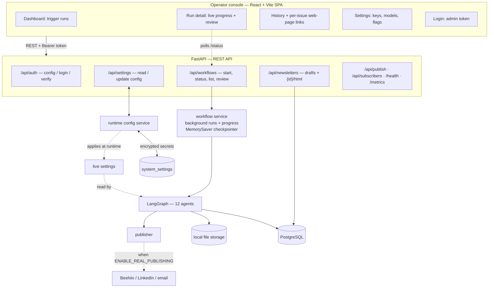
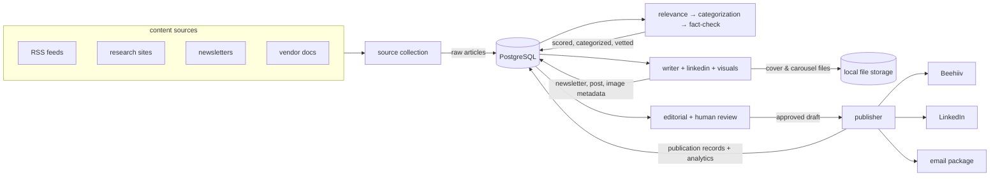

# System architecture, agent pipeline & data flow (as-built)

These diagrams reflect the **implemented** system across `frontend/`,
`app/api/`, `app/workflows/`, and `app/agents/` — generated from the actual code
([`graph.py`](../app/workflows/graph.py), [`routing.py`](../app/workflows/routing.py),
[`nodes.py`](../app/workflows/nodes.py), [`service.py`](../app/workflows/service.py),
and the API routers).

> The diagrams in [`../../ARCHITECTURE.md`](../../ARCHITECTURE.md) (§2 component,
> §3 agent-interaction) are the original **design-time** sketches and have
> drifted from the build (they reference pgvector, a Postgres checkpointer,
> Celery workers, S3, and a memory service that were not implemented). Use the
> diagrams below as the source of truth for how the system actually runs.

## System architecture (full stack)

The operator console (a React + Vite SPA) talks to the FastAPI backend over
REST. The API exposes auth, runtime configuration, workflow control, and the
per-issue HTML page. Workflow runs execute in the background; the UI polls for
live stage progress. Configuration set in the UI is encrypted at rest and
applied to the live settings the agents read.

**Key points (matching the code):**

- The SPA ([`frontend/`](../../frontend/)) is the primary interface; everything
  it does is also available directly over the REST API.
- `start` returns immediately and the run executes in the background; the UI
  polls `/api/workflows/{id}/status` for `run_state`, `progress_percent`, and the
  per-stage stepper.
- Auth is a single admin token (`REVIEW_AUTH_TOKEN`); when set, the `workflows`,
  `settings`, `publish`, and `subscribers` routes require it.
- UI-managed config is persisted to `system_settings` (secrets encrypted with a
  key derived from `SECRET_KEY`) and applied to the live `settings` object on
  save and on startup, so agents pick up keys/flags without an `.env` edit.
- Each issue has a self-contained HTML page at `/api/newsletters/{id}/html`
  (public), rendered from the stored draft — works even in simulated mode.

## How the agents connect

The newsletter is produced by a LangGraph state machine. Every hop is a
conditional edge, so any node failure diverts to the error handler. The graph
is compiled with `interrupt_after=[human_review]`, so it physically pauses after
human review and resumes when a review decision is posted.

**Key points (matching the code):**

- `editorial_review` is an **automated** QA pass. `route_editorial` sends a
  passing draft to `human_review`, a failing one to `draft_regeneration`.
- `human_review` is the **only** interrupt point. The run is checkpointed and
  the worker is released; nothing is held in memory waiting.
- `route_approval` branches on the reviewer's decision: `approved → publisher`,
  `feedback_required → feedback_processor`, `rejected → completion`.
- The feedback loop is `feedback_processor → draft_regeneration →
  editorial_review`, so a revised draft is re-reviewed before publishing.
- The newsletter writer is the content hub; `linkedin_writer` and
  `visual_generation` build on its draft.

## How data flows through the system

State is persisted in PostgreSQL between steps (the LangGraph checkpointer keeps
run state; the agents read/write domain tables). Generated image files are
written to local storage; publishing writes records and analytics back to the
database.

When `ENABLE_REAL_PUBLISHING` is off (default), the Beehiiv / LinkedIn / email
steps are simulated — records are written but no external calls are made.
